# embedded-ecg-gating-system

**Title:** ECG Gating System for Radiotherapy - Arduino-Based Cardiac Peak Detection

**University:** Tecnológico de Monterrey, Campus Ciudad de México  
**Lecture:** TE2010B - Digital Signal Processing Systems

**Authors:**
- Angel Aldana Contreras (A01658854@tec.mx)
- Arturo Vargas Cuevas (A01652564@tec.mx)

**Date:** March 18, 2023

---

## Table of Contents

1. [Overview](#overview)
2. [Key Features](#key-features)
3. [Hardware](#hardware)
4. [Algorithm Phases](#algorithm-phases)
5. [Development Process](#development-process)
6. [Technical Specifications](#technical-specifications)

---

## Overview

This project implements an Arduino-based ECG gating system for synchronizing radiotherapy procedures with cardiac activity. The system detects R-peaks and T-waves from ECG signals in real-time and outputs triggers for medical imaging synchronization. The development progressed through 8 phases, each adding critical functionality from basic threshold calibration to complete multi-wave cardiac gating.

---

## Key Features

- **Adaptive R-peak Detection:** Dynamic threshold calculation at 60% of signal maximum
- **T-wave Peak Detection:** Empiric voltage thresholds (1.8V-2.56V) with dynamic timing windows
- **P-wave Detection:** Complete cardiac cycle monitoring (0.5V-1.3V thresholds)
- **Real-time Processing:** Arduino-based signal acquisition and processing
- **Analog Signal Conditioning:** 0.61V-4.47V input range conditioning circuit
- **Synchronized Outputs:** LOW on R-peak, HIGH on T-peak detection

---

## Hardware

- Arduino microcontroller
- Analog-to-Digital Converter (10-bit, 0-1023 bits)
- Signal conditioning circuit with filtering and amplification stages
- Power supply unit
- ECG sensor interface

### File Structure

```
embedded-ecg-gating-system/
├── src/                    # Arduino source code
│   └── sketch.ino         # Main firmware
├── pictures/              # Development and hardware images
├── documentation/         # Project report and documentation
├── PCB/                   # PCB design files
│   ├── PCB_ECG_design/
│   ├── PCB_analog_filters_desgin/
│   └── PCB_power_supply_design/
└── README.md              # This file
```

---

## Development Process

### Fundamental Concepts

#### Cardiac Cycle

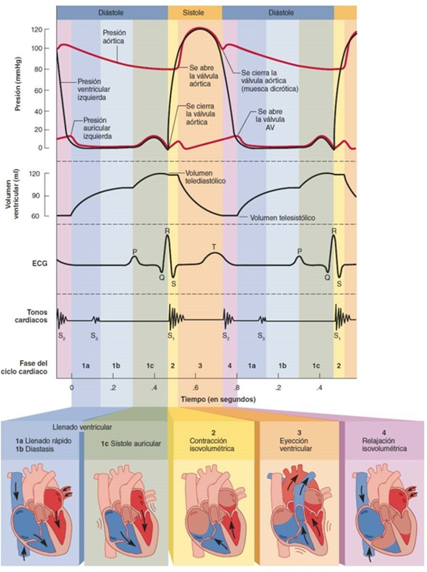

Understanding the cardiac cycle is essential for ECG signal processing. The system monitors three key waves:
- **P-wave:** Atrial depolarization (0.5V-1.3V range)
- **QRS Complex (R-peak):** Ventricular depolarization (60% of maximum)
- **T-wave:** Ventricular repolarization (1.8V-2.56V range)

#### Signal Processing Architecture

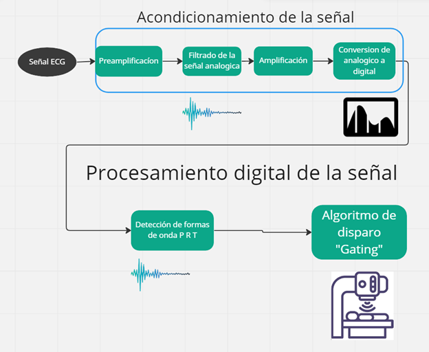

The ECG signal undergoes several processing stages:
1. Analog acquisition from ECG sensor
2. Analog signal conditioning (filtering, amplification)
3. ADC conversion to digital values (10-bit, 0-1023)
4. Threshold-based peak detection
5. Digital output triggering

---

## Algorithm Phases

### Phase 1: Threshold Calibration

**Objective:** Convert ECG voltage thresholds to ADC bit domain

The signal conditioning circuit constrains input to 0.61V-4.47V range, which maps to 0-1023 ADC bits. This phase establishes the voltage-to-bit conversion formula:

```
bit_value = (voltage_threshold / adc_voltage_range) * 1023
```

---

### Phase 2-3: R-peak Detection Algorithm

#### Maximum Value Tracking

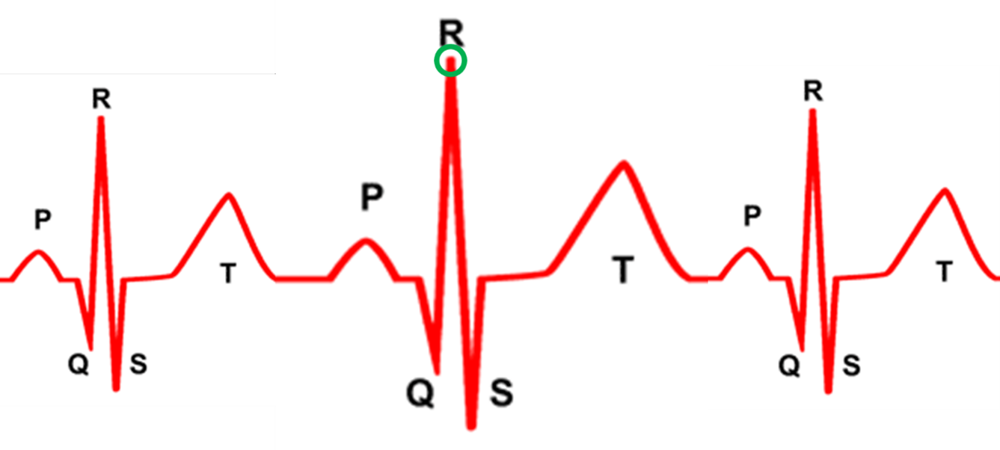

The algorithm continuously tracks the running maximum value of incoming samples. When a new maximum is detected, it updates the absolute maximum used for threshold calculation.

#### R-wave Threshold Detection

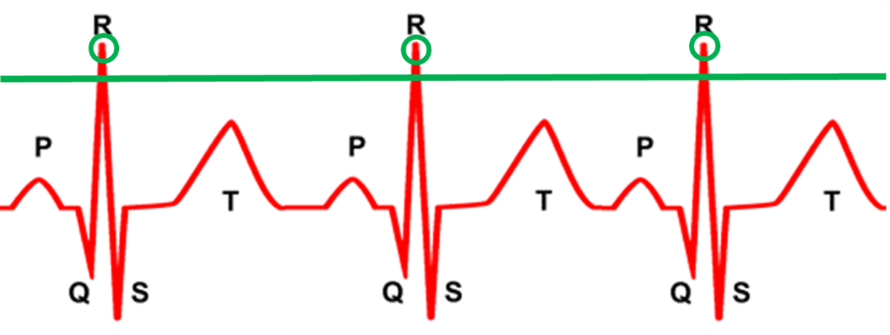

The R-peak detection threshold is calculated as 60% of the observed maximum during the adaptation phase. The system detects R-peaks when the signal exceeds this threshold.

#### Sample Counting

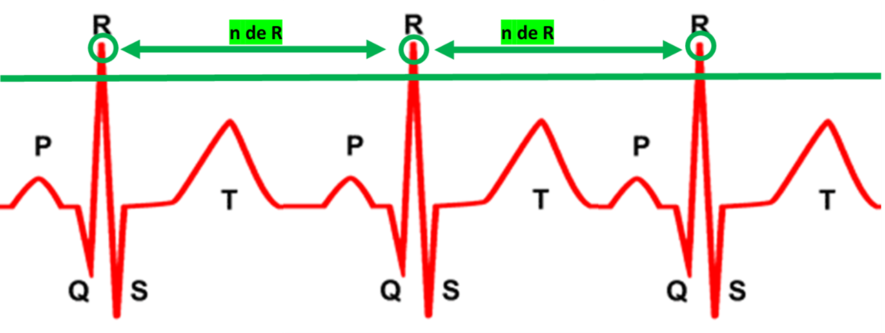

Between detected R-peaks, the system counts ADC samples. This counter is reset upon R-peak detection and used to establish dynamic timing windows for subsequent wave detection.

---

### Phase 4-5: Adaptive Threshold System

The system implements an **adaptation phase** of 30,000 samples where it:
1. Measures the maximum ECG signal amplitude
2. Calculates dynamic R-peak threshold (60% of max)
3. Stores empiric voltage thresholds for T and P waves
4. Enters detection phase once adaptation complete

This adaptive approach allows the system to self-calibrate for different patients and signal conditions.

---

### Phase 6-8: Multi-wave Detection

#### T-wave and P-wave Thresholds

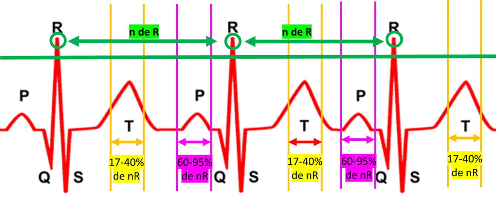

The system uses empiric voltage ranges for wave identification:
- **P-wave:** 0.5V - 1.3V (magenta lines)
- **T-wave:** 1.8V - 2.56V (orange lines)

#### Peak Detection

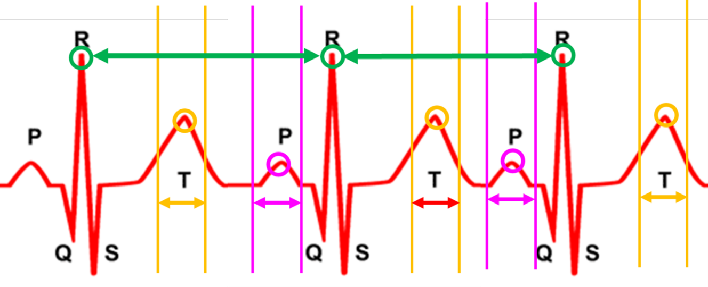

Within the dynamic detection windows:
- P-waves detected 50-300 samples before R-peak
- T-waves detected 200-1000 samples after R-peak

The system identifies local peaks as points where the signal value exceeds a threshold but the next sample falls below it.

#### Gating Output

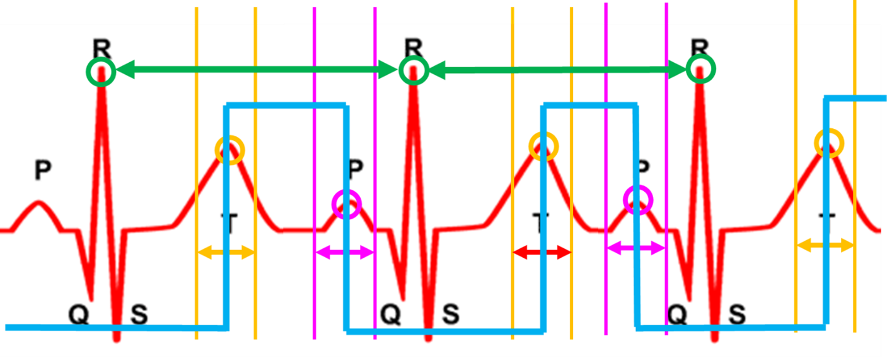

The final output (blue line) fires based on detected peaks:
- **LOW pulse** on R-peak detection
- **HIGH pulse** on T-peak detection

This synchronized output controls radiotherapy beam timing.

---

## Hardware Implementation

### Signal Conditioning Circuit

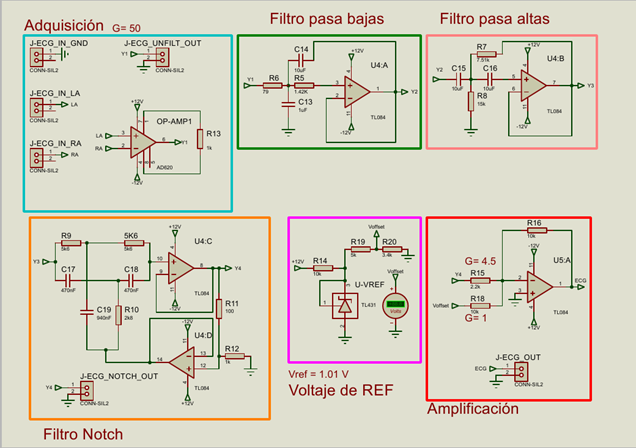

The analog signal conditioning stage includes:
- High-pass filtering to remove DC offset
- Low-pass filtering to remove noise
- Amplification to optimize ADC utilization

### Power Supply

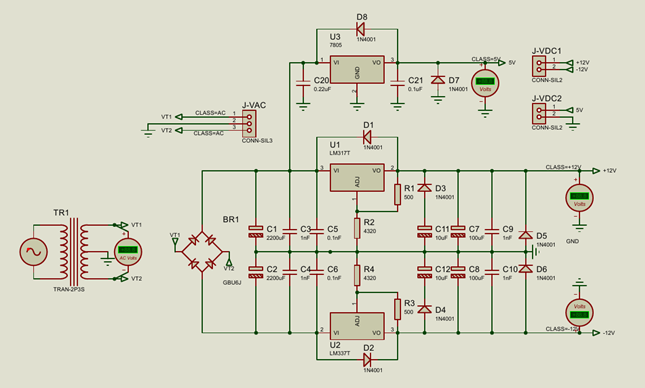

A dedicated linear power supply provides clean, regulated power for both analog and digital components.

### Complete System Design

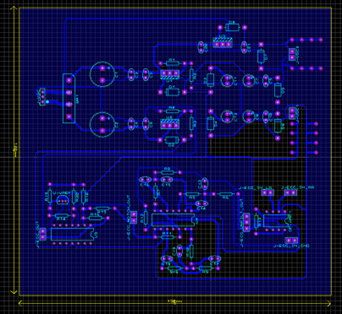

The full system integrates all three PCB stages into a unified design in Proteus CAD software.

---

## Prototype Development

### Analog Acquisition Prototype - First Version

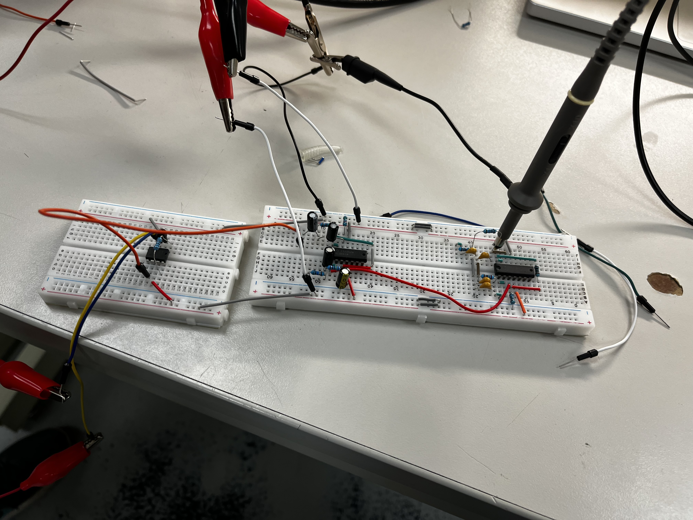

Initial implementation of the analog ECG acquisition and conditioning stages using breadboard prototyping.

### Analog Acquisition Prototype - Second Version

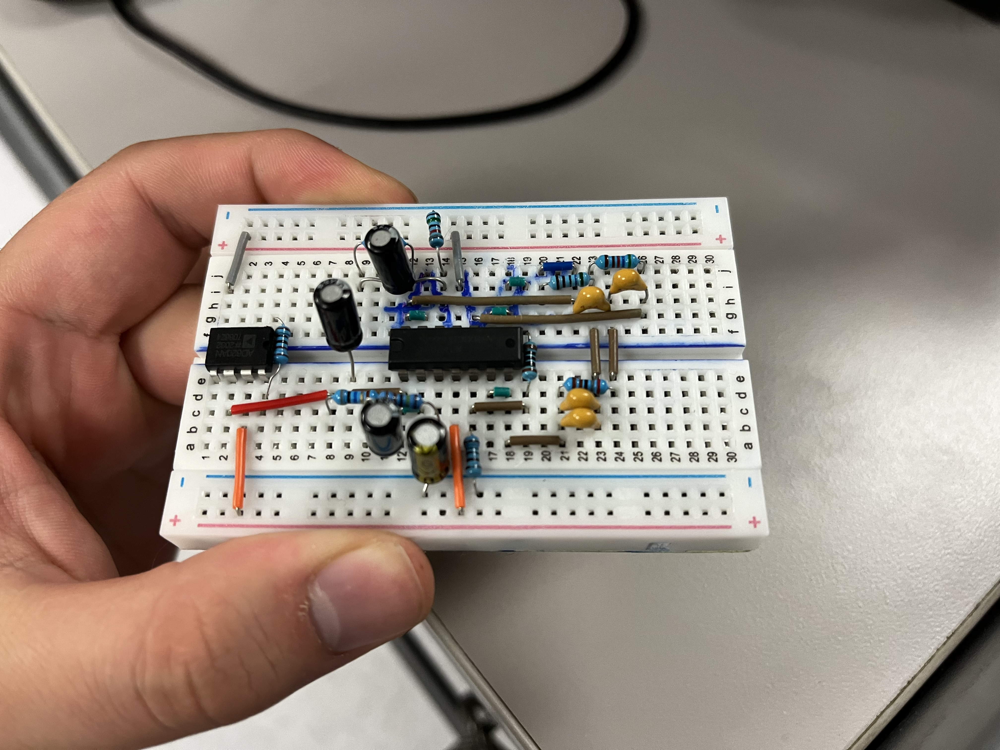

Refined prototype with improved signal quality and more stable component placement.

### Electrodes

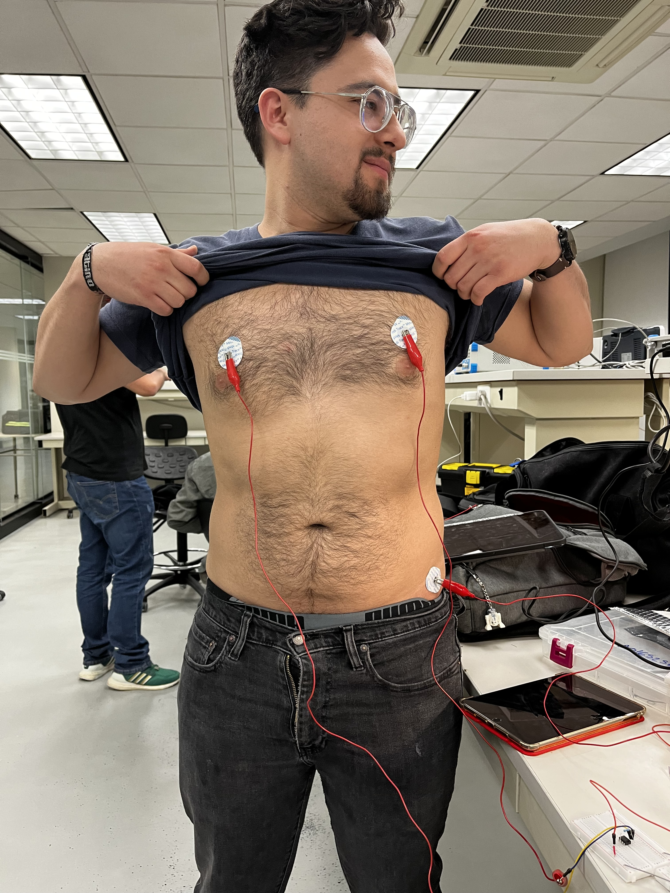

Standard bipolar lead configuration for ECG signal acquisition from patient.

---

## Final Hardware Build

### Oscilloscope Verification

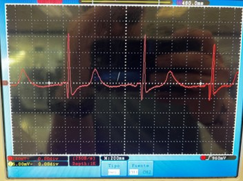

Real ECG signal acquisition verified with oscilloscope, showing proper signal conditioning and amplitude levels within 0.61V-4.47V range.

### Personal Signal Acquisition

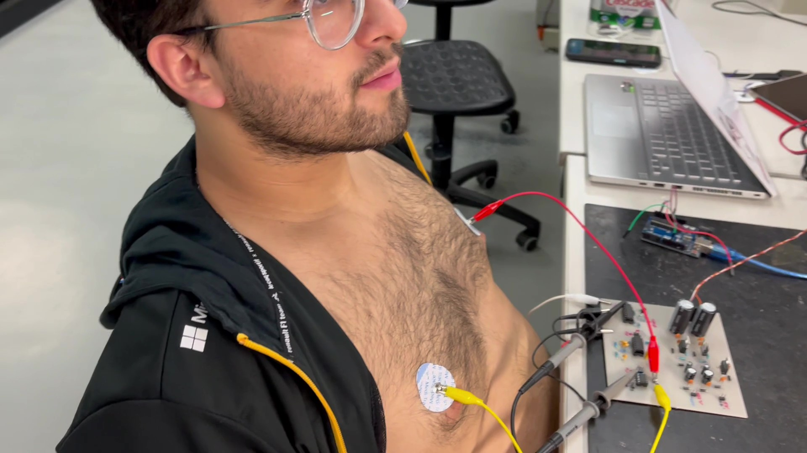

Real-time ECG signal acquisition from a subject, demonstrating the system's capability to capture live cardiac signals.

### Final Build - Front View

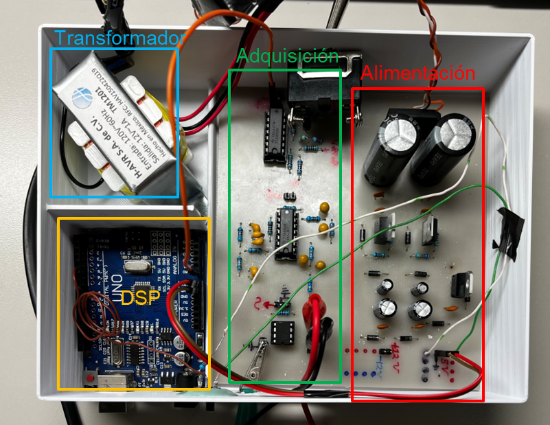

Final hardware implementation ready for deployment in radiotherapy synchronization.

---

## Algorithm Validation

### Gating on Real ECG Signal

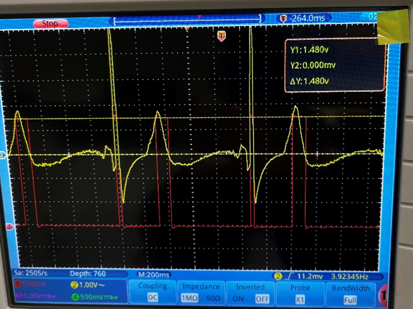

The system's gating output (blue line) synchronized with real patient ECG signals, showing proper R-peak and T-wave detection triggering.

### Gating on Simulated Signal

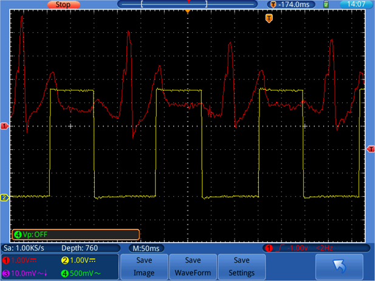

Validation of gating output on simulated ECG signals, confirming algorithm correctness under controlled conditions.

### In Vivo Detection

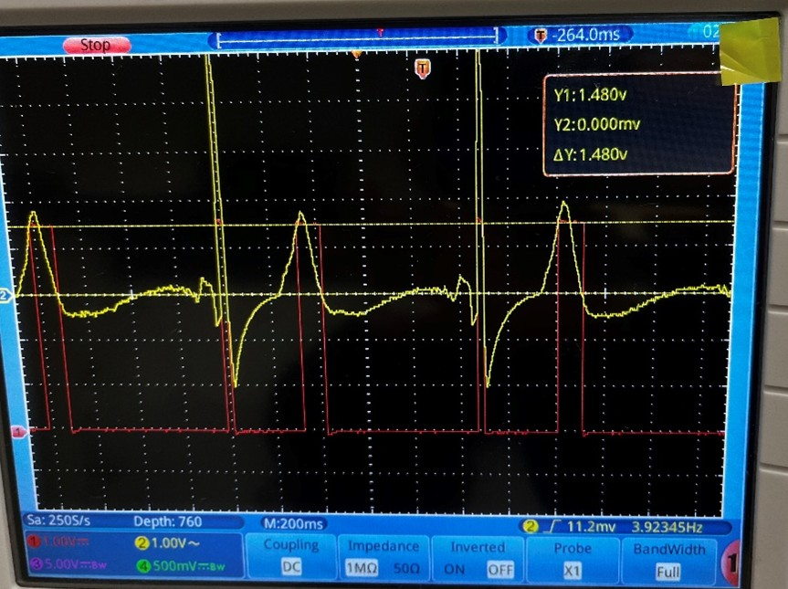

The complete system correctly identifies R-peaks and T-waves in real patient ECG signals, demonstrating successful cardiac gating capability.

---

## Technical Specifications

| Parameter | Value |
|-----------|-------|
| ADC Resolution | 10-bit (0-1023) |
| Input Voltage Range | 0.61V - 4.47V |
| R-peak Threshold | 60% of maximum |
| P-wave Range | 0.5V - 1.3V |
| T-wave Range | 1.8V - 2.56V |
| Adaptation Phase | 30,000 samples |
| Output Pin | Pin 11 (Arduino) |
| Input Pin | A3 (Arduino) |

---

## Key Achievements

✓ Adaptive R-peak detection with dynamic threshold  
✓ Multi-wave cardiac signal processing (P, R, T)  
✓ Real-time Arduino implementation  
✓ Synchronized gating output for radiotherapy  
✓ Hardware prototype validation with real ECG signals  
✓ Complete signal conditioning and power supply design  

---

## License

Educational project - Tecnológico de Monterrey
